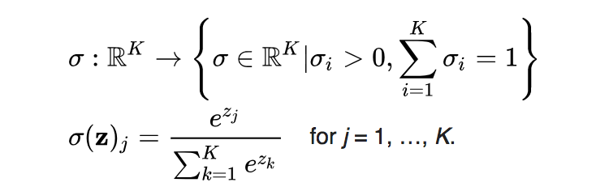

# Activation Functions Lab

## Objective

In this lab, we'll learn about different common activation functions, and compare and constrast their effectiveness on an MLP for classification on the MNIST data set!

### Getting Started: What Is An Activation Function?

In your words, answer the following question:

**_What purpose do acvtivation functions serve in Deep Learning?  What happens if our neural network has no activation functions?  What role do activation functions play in our output layer? Which activation functions are most commonly used in an output layer?_**

Write your answer below this line:
______________________________________________________________________________________________________________________

Activation functions allow our Deep Learning models to capture nonlinearity.  If ANNs are a symbolic representation of biological neural networks, then activation functions mirror the ability of neurons being able to fire with different levels of intensity based on the rapidity of how often they fire.  A model with no activation functions would just be a linear model.  In the output layer, activation functions make the results of our neural network's forward propagation step interpretable.  If the task we are trying to solve is a binary classification task, then we would use a sigmoid neuron, so that we can interpret the results as a probability, much like the output of a logistic regression. If our task is multi-class classification, then we would use a softmax function, which would have the network output a vector of probabilities, which each element corresponding to the probability that the observed input data belongs to a different class.  


For the first part of this lab, we'll only make use of the numpy library.  Run the cell below to import numpy.


```python
import numpy as np
```

## Writing Different Activation Functions

We'll begin this lab by writing different activation functions manually, so that we can get a feel for how they work.  

### Logistic Sigmoid Function


We'll begin with the **_Sigmoid_** activation function, as described by the following equation:

$$\LARGE \phi(z) = \frac{1}{1 + e^{-z}}  $$

In the cell below, complete the `sigmoid` function. This functio should take in a value and compute the results of the equation returned above.  


```python
def sigmoid(z):
    return 1 / (1 + np.exp(-z))
```


```python
sigmoid(.458) # Expected Output 0.61253961344091512
```


    0.61253961344091512


### Hyperbolic Tangent (tanh) Function 

The hyperbolic tangent function is as follows:


$$\LARGE  \frac{e^x - e^{-x}}{e^x + e^{-x}}  $$

Complete the function below by implementing the `tanh` function.  


```python
def tanh(z):
    numerator = np.exp(z) - np.exp(-z)
    denominator = np.exp(z) + np.exp(-z)
    return numerator / denominator
```


```python
print(tanh(2))
print(np.tanh(2))
print(tanh(0))
```

    0.964027580076
    0.0
    0.964027580076


### Rectified Linear Unit (ReLU) Function

The final activation function we'll implement manually is the **_Rectified Linear Unit_** function, also known as **_ReLU_**.  

The relu function is:

$$\LARGE  Max(0, z)  $$


```python
def relu(z):
    return np.max((0., z))
```


```python
print(relu(-2)) # Expected Result: 0.0
print(relu(2)) # Expected Result: 2.0
```

    0.0
    2.0


### Softmax Function

The **_Softmax Function_** is primarily used as the activation function on the output layer for neural networks for multi-class categorical prediction.  The softmax equation is as follows:



The mathematical notation for the softmax activation function is a bit dense, and this is a special case, since the softmax function is really only used on the output layer. Thus, the code for the softmax function ahs been provided.  

Run the cell below to compute the softmax function on a sample vector.  


```python
z = [1.0, 2.0, 3.0, 4.0, 1.0, 2.0, 3.0]
softmax = np.exp(z)/np.sum(np.exp(z))
softmax
```


    array([ 0.02364054,  0.06426166,  0.1746813 ,  0.474833  ,  0.02364054,
            0.06426166,  0.1746813 ])


**_Expected Output:_**

array([ 0.02364054,  0.06426166,  0.1746813 ,  0.474833  ,  0.02364054,
        0.06426166,  0.1746813 ])


## Comparing Training Results 

Now that we have experience with the various activation functions, we'll gain some practical experience with each of them by trying them all as different hyperparameters in a neural network to see how they affect the performance of the model. Before we can do that, we'll need to preprocess our image data. 

We'll build 3 different versions of the same network, with the only difference between them being the activation function used in our hidden layers.  Start off by importing everything we'll need from Keras in the cell below.

**_HINT:_** Refer to previous labs that make use of Keras if you aren't sure what you need to import


```python
import keras
from keras.models import Sequential
from keras.layers import Dense
from keras.datasets import mnist
```

### Preprocessing Our Image Data

We'll need to preprocess the MNIST image data so that it can be used in our model. 

In the cell below:

* Load the training and testing data and their corresponding labels from MNIST.  
* Reshape the data inside `X_train` and `X_test` into the appropriate shape (from a 28x28 matrix to a vector of length 784).  Also cast them to datatype `float32`.
* Normalize the data inside of `X_train` and `X_test`
* Convert the labels inside of `y_train` and `y_test` into one-hot vectors (Hint: see the [documentation](https://keras.io/utils/#to_categorical) if you can't remember how to do this).


```python
(X_train, y_train), (X_test, y_test) = mnist.load_data()
```


```python
X_train = X_train.reshape(60000, 784).astype('float32')
X_test = X_test.reshape(10000, 784).astype('float32')
X_train /= 255.
X_test /= 255.
```


```python
y_train = keras.utils.to_categorical(y_train, 10)
y_test = keras.utils.to_categorical(y_test, 10)
```

### Model Architecture

Your task is to build a neural network to classify the MNIST dataset.  The model should have the following architecture:

* Input layer of `(784,)`
* Hidden Layer 1: 100 neurons
* Hidden Layer 2: 50 neurons
* Output Layer: 10 neurons, softmax activation function
* Loss: `categorical_crossentropy`
* Optimizer: `'SGD'`
* metrics:  `['accuracy']`

In the cell below, create a model that matches the specifications above and use a **_sigmoid activation function for all hidden layers_**.


```python
sigmoid_model = Sequential()
sigmoid_model.add(Dense(100, activation='sigmoid', input_shape=(784,)))
sigmoid_model.add(Dense(50, activation='sigmoid'))
sigmoid_model.add(Dense(10, activation='softmax'))
```

Now, compile the model with the following hyperparameters:

* `loss='categorical_crossentropy'`
* `optimizer='SGD'`
* `metrics=['accuracy']`


```python
sigmoid_model.compile(loss='categorical_crossentropy', optimizer='SGD', metrics=['accuracy'])
```

Now, fit the model.  In addition to our training data, pass in the following parameters:

* `epochs=10`
* `batch_size=32`
* `verbose=1`
* `validation_data=(X_test, y_test)`


```python
sigmoid_model.fit(X_train, y_train, epochs=10, batch_size=32, verbose=1, validation_data=(X_test, y_test))
```

    Train on 60000 samples, validate on 10000 samples
    Epoch 1/10
    60000/60000 [==============================] - 4s 62us/step - loss: 2.2098 - acc: 0.3427 - val_loss: 2.0507 - val_acc: 0.5434
    Epoch 2/10
    60000/60000 [==============================] - 3s 50us/step - loss: 1.7576 - acc: 0.6277 - val_loss: 1.4165 - val_acc: 0.7204
    Epoch 3/10
    60000/60000 [==============================] - 3s 52us/step - loss: 1.1771 - acc: 0.7420 - val_loss: 0.9568 - val_acc: 0.7825
    Epoch 4/10
    60000/60000 [==============================] - 3s 51us/step - loss: 0.8374 - acc: 0.8064 - val_loss: 0.7163 - val_acc: 0.8338
    Epoch 5/10
    60000/60000 [==============================] - 3s 54us/step - loss: 0.6578 - acc: 0.8412 - val_loss: 0.5847 - val_acc: 0.8578
    Epoch 6/10
    60000/60000 [==============================] - 3s 53us/step - loss: 0.5556 - acc: 0.8610 - val_loss: 0.5044 - val_acc: 0.8727
    Epoch 7/10
    60000/60000 [==============================] - 3s 52us/step - loss: 0.4920 - acc: 0.8735 - val_loss: 0.4531 - val_acc: 0.8812
    Epoch 8/10
    60000/60000 [==============================] - 3s 50us/step - loss: 0.4490 - acc: 0.8819 - val_loss: 0.4175 - val_acc: 0.8881
    Epoch 9/10
    60000/60000 [==============================] - 3s 50us/step - loss: 0.4179 - acc: 0.8874 - val_loss: 0.3912 - val_acc: 0.8932
    Epoch 10/10
    60000/60000 [==============================] - 3s 53us/step - loss: 0.3945 - acc: 0.8924 - val_loss: 0.3711 - val_acc: 0.8971


    <keras.callbacks.History at 0x12d51f668>


## Fitting a Model with Tanh Activations

Now, we'll build the exact same model as we did above, but with hidden layers that use `tanh` activation functions rather than `sigmoid`.

In the cell below, create a second version of the model that uses hyperbolic tangent function for activations.  All other parameters, including number of hidden layers, size of hidden layers, and the output layer should remain the same. 


```python
tanh_model = Sequential()
tanh_model.add(Dense(100, activation='tanh', input_shape=(784,)))
tanh_model.add(Dense(50, activation='tanh'))
tanh_model.add(Dense(10, activation='softmax'))
```

Now, compile this model.  Use the same hyperparameters as we did for the sigmoid model. 


```python
tanh_model.compile(loss='categorical_crossentropy', optimizer='SGD', metrics=['accuracy'])
```

Now, fit the model.  Use the same hyperparameters as we did for the sigmoid model. 


```python
tanh_model.fit(X_train, y_train, epochs=10, batch_size=32, verbose=1, validation_data=(X_test, y_test))
```

    Train on 60000 samples, validate on 10000 samples
    Epoch 1/10
    60000/60000 [==============================] - 3s 50us/step - loss: 0.6078 - acc: 0.8449 - val_loss: 0.3572 - val_acc: 0.9015
    Epoch 2/10
    60000/60000 [==============================] - 3s 51us/step - loss: 0.3272 - acc: 0.9076 - val_loss: 0.2901 - val_acc: 0.9164
    Epoch 3/10
    60000/60000 [==============================] - 3s 51us/step - loss: 0.2764 - acc: 0.9211 - val_loss: 0.2521 - val_acc: 0.9253
    Epoch 4/10
    60000/60000 [==============================] - 3s 52us/step - loss: 0.2449 - acc: 0.9301 - val_loss: 0.2278 - val_acc: 0.9330
    Epoch 5/10
    60000/60000 [==============================] - 4s 58us/step - loss: 0.2212 - acc: 0.9368 - val_loss: 0.2076 - val_acc: 0.9392
    Epoch 6/10
    60000/60000 [==============================] - 3s 54us/step - loss: 0.2019 - acc: 0.9426 - val_loss: 0.1917 - val_acc: 0.9437
    Epoch 7/10
    60000/60000 [==============================] - 3s 52us/step - loss: 0.1856 - acc: 0.9482 - val_loss: 0.1791 - val_acc: 0.9473
    Epoch 8/10
    60000/60000 [==============================] - 3s 56us/step - loss: 0.1721 - acc: 0.9514 - val_loss: 0.1666 - val_acc: 0.9509
    Epoch 9/10
    60000/60000 [==============================] - 3s 56us/step - loss: 0.1600 - acc: 0.9550 - val_loss: 0.1563 - val_acc: 0.9549
    Epoch 10/10
    60000/60000 [==============================] - 3s 54us/step - loss: 0.1499 - acc: 0.9575 - val_loss: 0.1485 - val_acc: 0.9582


    <keras.callbacks.History at 0x12d7517b8>


## Fitting a Model with ReLU Activations

Finally, construct a third version of the same model, but this time with `relu` activation functions for the hidden layer.  


```python
relu_model = Sequential()
relu_model.add(Dense(100, activation='relu', input_shape=(784,)))
relu_model.add(Dense(50, activation='relu'))
relu_model.add(Dense(10, activation='softmax'))
```

Now, compile the model with the same hyperparameters as the last two models. 


```python
relu_model.compile(loss='categorical_crossentropy', optimizer='SGD', metrics=['accuracy'])
```

Now, fit the model with the same hyperparameters as the last two models. 


```python
relu_model.fit(X_train, y_train, epochs=10, batch_size=32, verbose=1, validation_data=(X_test, y_test))
```

    Train on 60000 samples, validate on 10000 samples
    Epoch 1/10
    60000/60000 [==============================] - 3s 51us/step - loss: 0.6758 - acc: 0.8139 - val_loss: 0.3310 - val_acc: 0.9071
    Epoch 2/10
    60000/60000 [==============================] - 3s 50us/step - loss: 0.3063 - acc: 0.9136 - val_loss: 0.2644 - val_acc: 0.9240
    Epoch 3/10
    60000/60000 [==============================] - 3s 51us/step - loss: 0.2505 - acc: 0.9285 - val_loss: 0.2226 - val_acc: 0.9357
    Epoch 4/10
    60000/60000 [==============================] - 3s 50us/step - loss: 0.2138 - acc: 0.9391 - val_loss: 0.1945 - val_acc: 0.9443
    Epoch 5/10
    60000/60000 [==============================] - 3s 51us/step - loss: 0.1865 - acc: 0.9464 - val_loss: 0.1733 - val_acc: 0.9488
    Epoch 6/10
    60000/60000 [==============================] - 3s 56us/step - loss: 0.1658 - acc: 0.9523 - val_loss: 0.1600 - val_acc: 0.9536
    Epoch 7/10
    60000/60000 [==============================] - 3s 51us/step - loss: 0.1497 - acc: 0.9572 - val_loss: 0.1448 - val_acc: 0.9581
    Epoch 8/10
    60000/60000 [==============================] - 3s 53us/step - loss: 0.1361 - acc: 0.9611 - val_loss: 0.1371 - val_acc: 0.9606
    Epoch 9/10
    60000/60000 [==============================] - 3s 52us/step - loss: 0.1248 - acc: 0.9641 - val_loss: 0.1306 - val_acc: 0.9614
    Epoch 10/10
    60000/60000 [==============================] - 3s 57us/step - loss: 0.1154 - acc: 0.9665 - val_loss: 0.1210 - val_acc: 0.9657


    <keras.callbacks.History at 0x12dc6d6d8>


## Conclusion

Which activation function was most effective?


